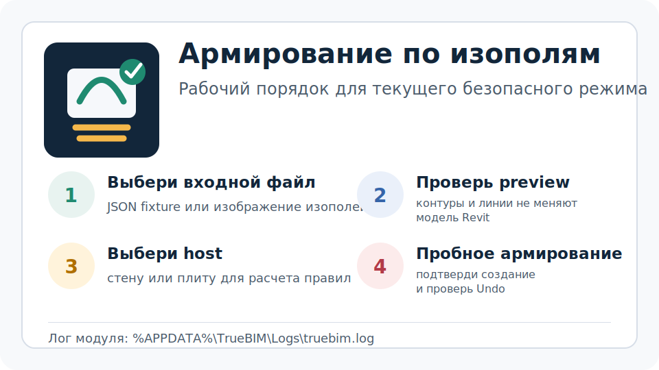
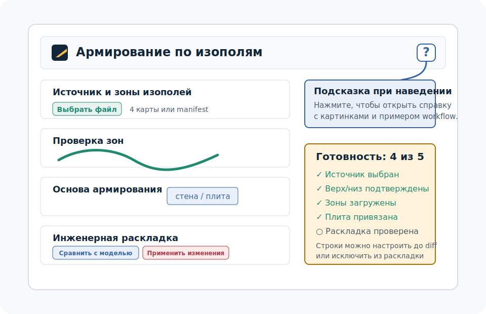
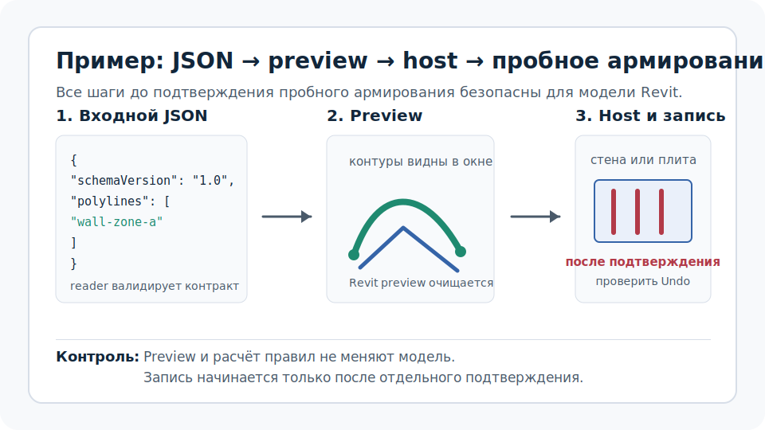

# Методичка: армирование по изополям

Эта методичка относится только к текущему модулю `Армирование по изополям`. Она описывает сценарий P4.1/P5.3b/P6.1: комплект карт, preview, выбор плиты, трёхточечная привязка, инженерный расчёт, ручную настройку и объединение зон, сравнение с моделью, отчёт JSON/CSV и идемпотентное применение отдельных стержней. JSON и прямые стены остаются legacy-сценарием пробной проверки.

## Где открыть справку в окне

В правом верхнем углу окна есть кнопка `?`. При наведении она показывает короткую подсказку, а по клику открывает встроенную методичку с картинками и примером. Эта справка не относится к другим инструментам TrueBIM.

## Как работает текущий режим

1. Пользователь выбирает исходный файл изополей: JSON fixture или изображение.
2. JSON читается сразу, изображения обрабатываются встроенным offline-распознавателем; настроенный CLI-worker может заменить его.
3. Результат распознавания превращается в контуры и показывается в окне модуля.
4. По отдельной кнопке контуры можно показать в Revit как управляемые preview-линии.
5. Пользователь выбирает host: простую прямую стену или горизонтальную плиту.
6. Для плиты пользователь задаёт две опорные и третью проверочную точку на карте, затем указывает соответствующие точки на верхней грани. Третья точка должна быть в стороне от линии первых двух.
7. Плагин отсекает зоны по внешнему контуру и отверстиям. Частично обрезанная зона остаётся рабочей и получает жёлтый пунктир; полностью потерянная зона или отклонение точки 3 более 50 мм блокируют расчёт.
8. Успешную привязку можно сохранить для текущего документа, активного вида и плиты. Загруженный профиль всегда проверяется заново на текущих зонах.
9. В инженерных параметрах пользователь явно выбирает `только усиление поверх базовой сетки` либо `полное сочетание внутри зон`, задаёт защитный слой, отступ от границ и минимальную длину.
10. `Рассчитать раскладку` берёт верхнюю границу диапазона зоны в `см²/м`, разбирает верхнюю подпись `d...s...`, проверяет принятую площадь и показывает линии стержней внутри clipped-регионов.
11. До сравнения выберите строку и нажмите `Настроить выбранную` либо откройте её двойным щелчком. Можно выбрать распознанное сочетание, ввести своё в формате `d12s200+d16s200` или исключить зону. Недостаточная принятая площадь блокирует сохранение.
12. Для непрерывной раскладки выделите через `Ctrl` или `Shift` минимум две касающиеся зоны и нажмите `Объединить выбранные`. У зон должны совпадать слой, грань, направление и сочетание; polygon union сохраняет реальную границу и отверстия.
13. `Разъединить` восстанавливает исходные зоны и stable id. `Сбросить всё` удаляет и ручные правила, и объединения; любое изменение пересчитывает preview и сбрасывает прежнее сравнение.
14. Кнопка `Сравнить с моделью` читает Rebar выбранной плиты, принадлежащие модулю, но не изменяет их. Таблица показывает по зонам `добавить / обновить / удалить / без изменений / исключена`; ранее созданная арматура исключённой или заменённой объединением зоны попадает в удаление.
15. Перед применением таблицу можно отфильтровать по слою, статусу, диаметру, шагу и confidence либо найти зону по имени/id, включая исходный id внутри объединения. Фильтры влияют только на отображение.
16. Кнопка `Экспорт отчёта` сохраняет рядом JSON и CSV. В отчёт входят зоны, итоги слоёв, hashes исходников, версия обработчика, привязка, инженерные настройки и fingerprint правил; если сравнение не выполнено, это явно отмечается.
17. Кнопка `Применить изменения` становится доступной только для проверенного diff с реальными изменениями. Перед записью модуль повторно читает модель; если diff устарел, применение блокируется, а таблица обновляется.
18. После подтверждения diff применяется одной транзакцией; повтор той же раскладки не создаёт дубли, ручная арматура без stable id не меняется. Отчёт можно повторить после применения, чтобы зафиксировать итоговый diff.

До шага создания армирования модуль не должен записывать арматуру в модель Revit.

## Пример

Для быстрой проверки используйте файл `docs/IsoFieldRebar/examples/sample-wall-zones.json`.

1. Откройте вкладку `TrueBIM`.
2. На панели `БИМ` нажмите `Армирование по изополям`.
3. Нажмите `Выбрать файл` и укажите `sample-wall-zones.json`.
4. Проверьте, что в блоке `Предпросмотр контуров` появились линии изополей.
5. При необходимости нажмите `Показать в Revit`, чтобы увидеть временные линии на активном 2D-виде.
6. Нажмите `Выбрать стену/плиту` и выберите простую стену. Для проверки плиты используйте `sample-slab-zones.json`, укажите три пары соответствующих точек и нажмите `Проверить привязку`.
7. Для плиты проверьте overlay: внешний контур зелёный, отверстия показаны пунктиром, точки 1–3 пронумерованы. Жёлтый пунктир означает корректное отсечение, красная зона — полную потерю и блокировку.
8. Сохраните профиль, сбросьте host, выберите ту же плиту на том же виде, загрузите профиль и убедитесь, что он проверен заново.
9. Для плиты выберите режим усиления, задайте защитный слой, отступ и минимальную длину.
10. Нажмите `Рассчитать раскладку`: проверьте `требуется/принято`, сочетание, X/Y, верх/низ, количество и линии внутри overlay.
11. Выберите строку и откройте `Настроить выбранную`. Сохраните допустимое пользовательское сочетание и проверьте пересчитанные площадь, компоненты, линии и количество; сочетание с недостаточной площадью должно блокироваться.
12. Исключите зону и убедитесь, что она остаётся в таблице с явной настройкой. Попытка исключить все зоны должна блокироваться.
13. Выделите две касающиеся зоны с одинаковыми правилами и объедините их. Проверьте одну строку, минимальный confidence исходных зон и непрерывные линии. Разнесённые зоны или разные сочетания должны отклоняться с понятной причиной.
14. Разъедините строку и убедитесь, что исходные зоны восстановились. Повторите объединение в обратном порядке выделения: merged zone id должен остаться тем же. Проверьте `Сбросить всё`.
15. Нажмите `Сравнить с моделью`: проверьте общие счётчики и строки таблицы. На первой миграции элементы P4.1 без сигнатуры могут попасть в `обновить`, заменённые исходные зоны — в `удалить`, новое объединение — в `добавить`.
16. Проверьте поиск по исходному id внутри объединения и каждый фильтр. Убедитесь, что подпись `показано` меняется, а итоговый diff и состав операции остаются прежними.
17. После сравнения измените правило, объединение или исключение: ожидается сброс diff и недоступная кнопка применения до нового сравнения.
18. Нажмите `Экспорт отчёта` до применения. Ожидаются соседние `.json` и `.csv`; проверьте четыре исходника с SHA-256, привязку, зоны, итоги As1X/As2X/As3Y/As4Y и текущий diff. При экспорте до сравнения должно быть `compared: false`.
19. Для проверки защиты от устаревшего diff после нового сравнения измените или удалите один принадлежащий модулю Rebar, затем нажмите `Применить изменения`: ожидается блокировка и обновлённая таблица без записи.
20. Повторно проверьте обновлённый diff, нажмите `Применить изменения`, подтвердите операцию, проверьте комментарии `TrueBIM IsoFieldRebar`, положение относительно отверстий и выполните Revit Undo.
21. Повторите расчёт и сравнение без изменений: ожидается `без изменений`, недоступная кнопка применения, отсутствие новой транзакции и дублей. Экспортируйте отчёт повторно и проверьте `compared: true`.

## Что считается корректным результатом

- JSON `schemaVersion: "1.0"` читается без ошибки.
- Контуры видны в окне модуля.
- Preview в Revit создается только как временные управляемые линии и очищается через `Очистить`.
- Для горизонтальной плиты трёхточечная привязка отсекает зоны по внешнему контуру и отверстиям; несовместимая привязка блокирует правила.
- Инженерные правила показывают требуемую и принятую площадь до записи в модель.
- Линии стержней и их расчётное количество видны в overlay до создания.
- Сравнение с моделью выполняется отдельной командой и заполняет фильтруемую таблицу до доступности применения.
- Ручное сочетание проходит ту же инженерную проверку площади; исключение зоны оставляет её видимой и пересчитывает раскладку без записи в Revit.
- Объединение совместимых соседних зон строит один точный polygon region; порядок выделения не меняет merged zone id, а разъединение возвращает исходные зоны.
- JSON/CSV-отчёт содержит все строки зон, итоги по слоям и достаточный provenance для проверки исходников и правил; экспорт не изменяет модель.
- Изменение модели после сравнения инвалидирует diff и не проходит к подтверждению применения.
- Арматура создаётся только после подтверждения; один Revit Undo возвращает модель в исходное состояние.

## Ограничения текущего режима

- Встроенное распознавание рассчитано на текущий шаблон растров ПК ЛИРА и строит консервативные convex-hull зоны; CLI-worker остаётся опциональной заменой.
- P4.1 создаёт отдельные стержни, а не сгруппированные `Rebar Set`/`Area Reinforcement`.
- Стены поддерживаются в простом прямом сценарии.
- Плита использует clipped-регионы и отверстия, защитный слой и минимальную длину. Фоновая базовая сетка вне зон, нахлёсты, анкеровка и наклонные/составные плиты пока не поддерживаются.
- P5.3b поддерживает идемпотентный повтор, ручную настройку и объединение зон, а также отдельную таблицу сравнения для инженерной раскладки плиты. Legacy-сценарий стены остаётся пробным и не участвует в diff.
- P6.1 экспортирует воспроизводимый отчёт, но пока не классифицирует предупреждения как допустимые/блокирующие и не выполняет отдельный QA покрытия и пересечений.
- Объединяются только касающиеся или пересекающиеся зоны с одинаковыми правилами. Разрывы не заполняются, а созданные стержни пока не оформляются как `Rebar Set`/`Area Reinforcement`.
- Справка описывает только модуль `Армирование по изополям`.

## Что приложить к отчету об ошибке

- версию Revit;
- входной JSON или изображение;
- тип host-элемента: стена или плита;
- скриншот окна `Армирование по изополям`;
- созданные файлы `isofield-rebar-report-*.json` и `.csv`;
- лог `%APPDATA%\TrueBIM\Logs\truebim.log`;
- описание шага: загрузка файла, preview, выбор host, расчёт раскладки или создание.

После сборки установщика этот файл должен лежать в установленном пакете по пути `%APPDATA%\TrueBIM\<RevitVersion>\Docs\isofield-rebar-workflow-guide.md`, а картинки должны лежать рядом в `%APPDATA%\TrueBIM\<RevitVersion>\Docs\assets`.
