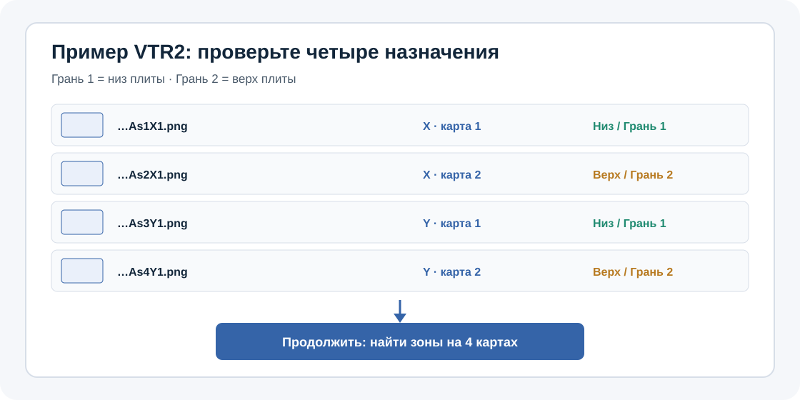
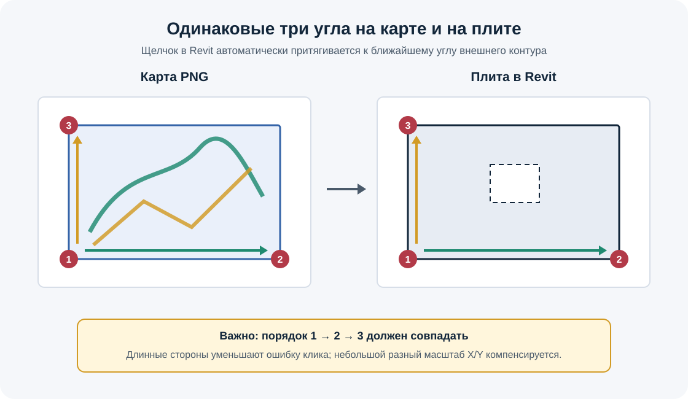

# Армирование по изополям: пошаговая инструкция

Модуль помогает перенести зоны требуемого армирования с расчётных карт на конструкцию. Для горизонтальных плит он рассчитывает общие прямоугольные массивы дополнительного армирования. Вы сначала проверяете карты, привязку и будущую раскладку, затем сравниваете её с моделью и после этого создаёте или обновляете экземпляры семейств.

## Что подготовить

- Откройте проект Revit и нужный вид.
- Подготовьте четыре карты из одного расчёта: две для направления X и две для направления Y.
- Для надёжного автоназначения в имени каждого файла должна встречаться одна из меток `As1X`, `As2X`, `As3Y`, `As4Y`. Метка может находиться в любой части имени, регистр букв не важен; например, `Плита_As1X1.png` подходит. Модуль дополнительно пытается прочитать метку в заголовке самой карты; если имя и заголовок противоречат друг другу, строка блокируется до ручного выбора.
- Убедитесь, что все четыре карты относятся к одной расчётной схеме и имеют одинаковый размер изображения. Небольшое различие масштаба по X и Y внутри экспортированного PNG компенсируется привязкой по трём точкам.
- Для плиты заранее определите, какие карты относятся к низу и верху.
- Для стены определите, какие карты относятся к внутренней и наружной стороне.
- Выберите на карте три хорошо заметные точки, которые сможете указать и на конструкции. Третья точка не должна лежать на одной линии с первыми двумя.

Привязка карт доступна для горизонтальных плит и прямых обычных стен. Создание описанных здесь семейств массивов предназначено для плит. Наклонные плиты, криволинейные, составные и витражные стены пока не поддерживаются.

## Что меняет модель

| Действие | Что произойдёт |
|---|---|
| Просмотр контуров в окне | Модель не изменится. |
| «Исправить зоны» | Изменится только текущий расчёт в окне. |
| «Показать зоны на конструкции» | Только после успешной привязки на текущем виде появятся обрезанные по выбранной конструкции вспомогательные линии. Это элементы модели, но не арматура. |
| «Удалить линии с вида» | Вспомогательные линии этого модуля будут удалены с текущего вида. |
| «Рассчитать раскладку» | Модель не изменится. |
| «Сравнить с моделью» | Модуль только прочитает ранее созданную им арматуру и покажет список будущих изменений. |
| «Сохранить отчёт» | Будут созданы файлы отчёта. Модель не изменится. |
| «Применить изменения» | После отдельного подтверждения будут созданы или обновлены только экземпляры семейств дополнительного армирования, которыми управляет модуль. Отдельные системные стержни и ручное армирование не затрагиваются. |

## Где открыть эту инструкцию

В правом верхнем углу окна нажмите кнопку со знаком вопроса. Откроется краткая инструкция с теми же названиями разделов и кнопок, что и в основном окне.

## Шаг 1. Загрузите карты изополей

1. На вкладке TrueBIM нажмите «Армирование по изополям».
2. В разделе «1. Загрузите карты изополей» нажмите «Выбрать карты или готовые зоны».
3. Выберите сразу четыре карты.
4. Убедитесь, что в окне появились четыре строки с небольшими изображениями карт.
5. Проверьте столбец «Карта». Должны быть назначены две карты для направления X и две карты для направления Y.
6. Проверьте предложенные стороны: по стандартной схеме As1X и As3Y назначаются на низ, As2X и As4Y — на верх. Это стартовый вариант, его можно изменить.
7. Если строка подсвечена красным, имя файла и заголовок указывают разное назначение. Выберите правильное назначение вручную.
8. При нестандартной расчётной схеме измените сторону конструкции:
   - для плиты — низ или верх;
   - для стены — внутреннюю или наружную сторону;
   - если конструкция ещё не выбрана — сторону 1 или сторону 2, затем проверьте назначение после выбора конструкции.
9. Под таблицей карт нажмите выделенную кнопку «Продолжить: найти зоны на 4 картах». Команда специально продублирована снизу, поэтому прокручивать окно обратно вверх не нужно.
10. Дождитесь сообщения о завершении. Проверьте количество найденных контуров и цветовых шкал.

Если комплект понадобится ещё раз, нажмите «Сохранить комплект». Позже его можно открыть той же кнопкой «Выбрать карты или готовые зоны».

### Пример для проекта VTR2

Для набора из папки `Армирование` используйте следующее назначение:

| Окончание имени файла | Ось | Карта | Грань плиты |
|---|---:|---:|---|
| `As1X1` | X | 1 | низ |
| `As2X1` | X | 2 | верх |
| `As3Y1` | Y | 1 | низ |
| `As4Y1` | Y | 2 | верх |

Стандартное назначение заполняется автоматически. Если плита ещё не выбрана, список показывает нейтральные подписи «Сторона 1» и «Сторона 2»; после выбора плиты они меняются на «Низ» и «Верх» без потери назначения.

### Если открыт готовый файл с зонами

Такой файл подходит для ознакомления и проверки контуров. Для расчёта и создания арматуры всё равно понадобятся четыре исходные карты с цветовыми шкалами.

## Шаг 2. Проверьте найденные зоны

1. В разделе «2. Проверьте найденные зоны» осмотрите контуры.
2. Сравните их с исходными картами: проверьте, что все требуемые пятна найдены и находятся на своих местах. При распознавании PNG соседние цветовые уровни могут объединяться в одно пятно с внешней выпуклой границей и наибольшим уровнем армирования. Число контуров поэтому может отличаться от числа отдельных цветных участков.
3. Нажмите «Исправить зоны», если нужно:
   - убрать лишнюю область;
   - вернуть ошибочно исключённую область;
   - выбрать другой диапазон площади;
   - объединить соседние области с одной карты и одного диапазона.
4. В окне исправления снимите флажок «Учитывать» у лишней зоны.
5. Для смены диапазона выберите нужное значение в столбце «Диапазон площади».
6. Для объединения выделите несколько соседних строк и нажмите «Объединить выбранные».
7. Нажмите «Применить правки».

### Вспомогательные линии на виде

Кнопка «Показать зоны на конструкции» находится в блоке привязки шага 3. Она становится доступна только после успешной проверки трёх точек. Линии строятся в координатах выбранной плиты или стены и заранее обрезаются по её внешнему контуру и отверстиям.

После проверки нажмите «Удалить линии с вида». Если зоны или привязка были исправлены, повторный показ заменит прежние линии новыми.

## Шаг 3. Выберите стену или плиту

1. В разделе «3. Выберите стену или плиту» нажмите «Выбрать стену/плиту».
2. Укажите конструкцию в Revit.
3. Прочитайте сообщение под кнопками:
   - если конструкция подходит, переходите к совмещению;
   - если конструкция не подходит, модуль объяснит причину.
4. Проверьте назначение сторон карт. Для выбранной плиты должны быть назначены низ и верх, для стены — внутренняя и наружная стороны.

## Шаг 4. Совместите карты с конструкцией

В раскрытом блоке «Совмещение карты с конструкцией по трём точкам» задаются три пары одинаковых точек: одна точка на карте и та же точка на стене или плите.

Для прямоугольной плиты после её выбора модуль автоматически расставляет точки на трёх углах внешнего контура. Проверьте координаты перед применением; точки можно указать заново вручную. Для сложного контура, у которого нет всех четырёх углов габаритной рамки, автоматическая расстановка не выполняется.

После распознавания модуль ищет границы большого расчётного поля на каждой из четырёх карт и подставляет три согласованных угла рамки. Проверьте координаты перед выбором точек в Revit. Если минимум три карты не дали одинаковые границы с допуском 3 пикселя, остаётся безопасный резервный вариант по крайним распознанным зонам — тогда углы рамки нужно исправить вручную.

1. Точка 1 — общий угол. На карте введите координаты угла рамки, затем нажмите «Указать точку 1 на конструкции» и щёлкните рядом с тем же углом плиты.
2. Точка 2 — дальний угол вдоль одной стороны от точки 1. Чем больше расстояние 1–2, тем меньше влияет неточный клик.
3. Точка 3 — дальний угол вдоль соседней стороны от точки 1. Она не должна лежать на линии 1–2.
4. Клик на плите автоматически привязывается к ближайшему углу её внешнего контура в радиусе 1000 мм. В строке под кнопкой проверьте сообщение «привязана к ближайшему углу».
5. Если вертикальное направление карты получилось обратным, включите «Перевернуть карту по вертикали».
6. Нажмите «Проверить привязку».
7. Осмотрите схему:
   - внешняя линия показывает границу конструкции;
   - пунктиром показаны отверстия;
   - зоны внутри конструкции показаны обычными цветами;
   - красные зоны полностью оказались за границами и не позволяют продолжить;
   - в статусе отдельно показаны масштабы X и Y;
   - небольшое различие масштаба экспортированной картинки компенсируется автоматически;
   - неправильный порядок углов, зеркальность или сильное искажение блокируют расчёт.
8. Если проверка не пройдена, наведите мышь на красный статус, прочитайте подробности, исправьте точки и повторите проверку.
9. Если проверка пройдена, нажмите «Показать зоны на конструкции» и визуально сверьте линии с плитой.
10. При необходимости нажмите «Сохранить привязку».

Кнопка «Восстановить привязку» доступна только для той же конструкции и того же вида. После восстановления модуль всё равно проверит её на текущих зонах.

## Шаг 5. Рассчитайте раскладку

1. В разделе «4. Рассчитайте и проверьте арматуру» раскройте «Параметры раскладки».
2. Для общих массивов плиты выберите «Только усиление поверх базовой сетки»: первая сетка сочетания считается уже существующей. Режим «Полное сочетание внутри зон» рассчитывает отдельные компоненты внутри исходных зон и не выполняет описанное ниже планирование общих пятен с анкеровкой.
3. Укажите отступ арматуры от поверхности конструкции.
4. Укажите отступ от границ и отверстий. Для общего массива это минимальный зазор до края плиты и проёмов; он не укорачивает стержни внутри расчётного пятна.
5. Укажите минимальную длину стержня. Это дополнительное ограничение длины, а не длина анкеровки.
6. Нажмите «Рассчитать раскладку».
7. Проверьте на схеме оси будущих элементов дополнительного армирования, их направление и количество.
8. Раскройте «Проверка зон и арматуры» и прочитайте все сообщения.

Ошибки не позволяют продолжить. Предупреждения требуют проверки. Если предупреждение допустимо, установите флажок «Я проверил отмеченные места и разрешаю применить эту раскладку».

Ошибка геометрии или анкеровки блокирует соответствующее пятно и применение всей раскладки. Пятно не исключается автоматически, а подтверждение предупреждений не снимает такую ошибку. Проверьте исходные карты, привязку, контур плиты и причину блокировки. Если прямым стержням не хватает места у края или проёма, требуется отдельное решение с разделением или загибами; уменьшать требуемую анкеровку ради прохождения проверки нельзя.

Любое изменение карт, зон, привязки или параметров сбрасывает прежнее подтверждение предупреждений.

### Как рассчитывается общий массив плиты

Касающиеся и пересекающиеся области одной карты, стороны и направления образуют общее пятно. Для него выбираются максимальный диаметр и минимальный шаг дополнительной арматуры. Раздельные области остаются разными пятнами; карты X/Y и верх/низ не смешиваются.

Ширина массива перекрывает всё пятно и увеличивается до целого количества шагов. Крайние стержни входят в раскладку: например, ширина 2600 мм при шаге 200 мм даёт 14 стержней. Семейство массива требует не менее двух стержней. Одиночная расчётная линия не превращается в дополнительный стержень без проверки расширенной области по плите.

Полная длина анкеровки читается из таблицы проверенного семейства для класса стали, диаметра и класса бетона плиты. Если эти данные не подтверждены, расчёт блокируется. От каждого исходного уровня стержни продлеваются на полную анкеровку, умноженную на отношение площади дополнительной арматуры этого уровня к площади принятой дополнительной арматуры, но не менее чем на 300 мм. Базовая сетка в это отношение не входит.

Когда PNG уже распознан как одна выпуклая область с максимальным уровнем, полная анкеровка применяется от всей её границы. Это даёт запас, но не восстанавливает потерянные внутренние уровни и не оптимизирует расход так же, как подробный пример в руководстве.

До проверки границ длина симметрично увеличивается до фактического размера, поддерживаемого проверенным семейством `000` с включённой кратной длиной. Например, требуемые 1089 мм превращаются в 1170 мм, 1500 мм — в 1670 мм. Это сортамент конкретного семейства, а не нормативная таблица из PDF. Для длины свыше 11700 мм требуется разделение пятна.

Весь полученный прямоугольник проверяется по контуру плиты, отверстиям и заданному зазору. Нельзя заполнить отверстие прямоугольником только потому, что несколько расчётных линий проходят по его сторонам. Непрерывные группы одинаковых стержней могут образовывать отдельные массивы; пропущенные ряды и разные длины не заполняются автоматически.

## Шаг 6. Проверьте и при необходимости настройте зоны

В таблице «Проверка зон и изменений» видны карта, сторона конструкции, сочетание арматуры, требуемая и принятая площадь, количество стержней и то, насколько уверенно найдена зона.

После планирования общего пятна его сочетание, геометрию и включение нельзя менять в обход повторной проверки анкеровки. Для исправления вернитесь к исходным зонам через «Исправить зоны», затем рассчитайте раскладку заново. Заблокированное пятно также нельзя исключить как «пустой фрагмент».

Для исходных зон в режимах, где ручная настройка доступна:

1. Выберите строку.
2. Нажмите «Настроить выбранную» или дважды щёлкните строку.
3. Проверьте, должна ли зона участвовать в раскладке. Исключение допустимо для ошибочно распознанной области и не заменяет армирование, требуемое расчётом.
4. Выберите найденное сочетание либо введите своё.
5. Нажмите «Применить настройку».

После изменения раскладка пересчитается. Сравнение с моделью нужно будет выполнить заново.

Ручное объединение исходных зон доступно для соседних строк с одинаковыми настройками. Кнопка «Разъединить» вернёт исходные зоны, а «Сбросить всё» удалит ручные настройки и объединения. К уже рассчитанным общим пятнам эти команды не применяются: они формируются заново из исходных областей.

## Шаг 7. Сравните раскладку с моделью

1. Нажмите «Сравнить с моделью».
2. Дождитесь обновления таблицы.
3. Проверьте столбцы «Статус» и «Изменения».
4. Убедитесь, что количества добавляемых, изменяемых и удаляемых экземпляров семейств ожидаемы.
5. При необходимости отберите строки по карте, результату сравнения, диаметру, шагу или точности поиска зоны.

Отбор строк меняет только вид таблицы. Он не исключает скрытые строки из применения.

Если модель изменилась после сравнения, модуль не применит устаревший список. Таблица обновится, и её нужно будет проверить ещё раз.

## Шаг 8. Сохраните отчёт и примените изменения

1. Нажмите «Сохранить отчёт», если результат нужно проверить позже или передать коллегам.
2. После проверки таблицы нажмите «Применить изменения».
3. В окне подтверждения ещё раз проверьте конструкцию, режим, количество зон и количество стержней.
4. Подтвердите действие.
5. Дождитесь блока «Последнее применение».
6. Сопоставьте число добавленных, изменённых, удалённых и неизменённых экземпляров массивов с расчётным количеством стержней.
7. Если отчёт был сохранён до применения, нажмите «Обновить итоговый отчёт».

Для текущей раскладки прямых массивов обязательно семейство `(Массив • У) Арматура • 000`. Проверяется фактический класс стали A500С по параметрам и таблице семейства, а не только по названию типа. Тип нужного диаметра, шага и класса бетона выбирается либо создаётся на основе подтверждённого типа. Формулы, вложенные семейства и файлы `.rfa` не изменяются.

Один проверенный прямоугольный массив создаётся одним экземпляром семейства. Параметр `A` задаёт согласованную длину стержня, `Зона • Ширина` — расстояние между крайними рядами. Экземпляр размещается с учётом центра семейства и поворачивается по направлению стержней. После обновления Revit модуль сверяет вычисленные семейством длину, ширину и количество с планом. Несовпадение отменяет применение.

В предоставленном семействе один физически моделируемый стержень представляет всю зону; массив на плане показывается условной графикой и прямоугольной областью, а количество рассчитывается параметрами семейства. Поэтому количество экземпляров, количество видимых физических тел и расчётное количество стержней — разные величины. Проверяйте план, размеры, шаг и количество в свойствах семейства вместе с отчётом. Модуль сохраняет это устройство исходного семейства и не создаёт системные Rebar для каждого ряда.

Изменяются только экземпляры, которыми управляет модуль на выбранной конструкции. Повторное применение той же раскладки не должно создавать копии.

## Что проверить после применения

- Стороны конструкции и направления X и Y.
- Отступ арматуры от поверхности конструкции.
- Полную длину с анкеровкой и фактическим округлением семейства; зазоры до краёв и отверстий.
- Диаметры и шаг стержней.
- Количество экземпляров массивов и расчётное количество стержней в каждом из них.
- Отсутствие лишних вспомогательных линий на виде.
- Возможность отменить все изменения арматуры одной стандартной командой отмены Revit.

## Частые затруднения

### Кнопка недоступна

Посмотрите блок «Готовность» справа. В нём написан следующий обязательный шаг. Обычно не назначена сторона одной карты, не пройдена привязка, не исправлена ошибка проверки или ещё не выполнено сравнение с моделью.

### Комплект не готов

Проверьте, что выбраны ровно четыре карты, для каждой указаны направление, номер и сторона конструкции, а размеры всех карт совпадают.

### Конструкция не поддерживается

Выберите прямую обычную стену или горизонтальную плиту. Для конструкций сложной формы расчёт и создание арматуры пока недоступны.

### Третья точка не прошла проверку

Проверьте, что точки выбраны на одних и тех же трёх углах и в одном порядке: 1 — общий угол, 2 — вдоль первой стороны, 3 — вдоль соседней. Точка 3 должна находиться далеко от линии 1–2. Если она оказалась по другую сторону, исправьте порядок или переключите «Перевернуть карту по вертикали». Различие масштаба X/Y до 15% допускается и компенсируется автоматически.

### Линии появились в стороне от плиты

Нажмите «Удалить линии с вида». Убедитесь, что выбрана нужная плита и статус привязки зелёный, затем повторите «Показать зоны на конструкции». Новая версия не позволяет строить линии по условному масштабу без принятой привязки и использует только зоны, обрезанные по выбранной конструкции.

### Зона стала красной

Она полностью оказалась за границами конструкции. Проверьте точки совмещения, масштаб, направление карты и правильность выбранной стены или плиты.

### Раскладка содержит ошибку по площади

Принятая площадь арматуры меньше требуемой. Выберите другое сочетание диаметра и шага либо верните рассчитанное сочетание.

### Не найдено семейство дополнительного армирования

Для текущих прямых массивов в проекте должно быть семейство `(Массив • У) Арматура • 000` с типом, фактические параметры которого подтверждают A500С. Если оно отсутствует, загрузите проверенное семейство из проектной библиотеки и повторите расчёт. Одного текста «A500С» в имени типа недостаточно. Отсутствие таблицы анкеровки или неподтверждённый класс стали также блокируют применение.

### Семейств получилось почти столько же, сколько стержней

После сравнения сопоставьте расчётное количество стержней с количеством добавляемых экземпляров. В режиме дополнительного усиления на одно допустимое общее пятно приходится один прямоугольный массив. При раздельных областях или разных длинах массивов может быть несколько; их границы должны соответствовать проверенной схеме. Одиночный стержень не считается допустимым массивом. Если состав не совпадает с планом, сохраните отчёт и журнал работы.

### В 3D виден один стержень вместо всех рядов

У предоставленного семейства это способ представления зоны. Проверьте её прямоугольную графику на плане и фактические параметры длины, ширины, шага и количества. Нельзя оценивать раскладку только по числу физических стержней в 3D.

### Прямой массив пересекает проём или не помещается у края

Такое пятно остаётся заблокированным. Модуль не удаляет проёмы, не сокращает анкеровку и не исключает требуемое усиление ради создания массива. Автоматическое разделение сложного пятна вокруг проёма и подбор загибов пока не реализованы. Наличие других форм семейств в папке не означает, что они участвуют в этом алгоритме.

### Соответствует ли раскладка всему руководству PDF

Реализованы общие пятна, выбор усиления, покрытие ширины, анкеровка по подтверждённым данным и учёт фактических длин проверенного семейства. Полное соответствие всему руководству не заявляется: внутренние уровни PNG могут теряться при распознавании, экономическая оптимизация протяжённых зон и загибы у краёв требуют отдельного решения. Проверка проектировщиком остаётся частью проверки результата.

### Применение просит повторно проверить таблицу

После последнего сравнения модель изменилась. Это защитная проверка. Просмотрите обновлённые строки и снова нажмите «Применить изменения».

## Что приложить к сообщению об ошибке

- Версию Revit и название проекта.
- Четыре исходные карты или сохранённый комплект.
- Снимок окна на шаге, где возникла ошибка.
- Название выбранной стены или плиты.
- Краткое описание: что было выбрано, какая кнопка нажата и что произошло.
- Журнал работы, который открывается кнопкой «Открыть журнал работы».
