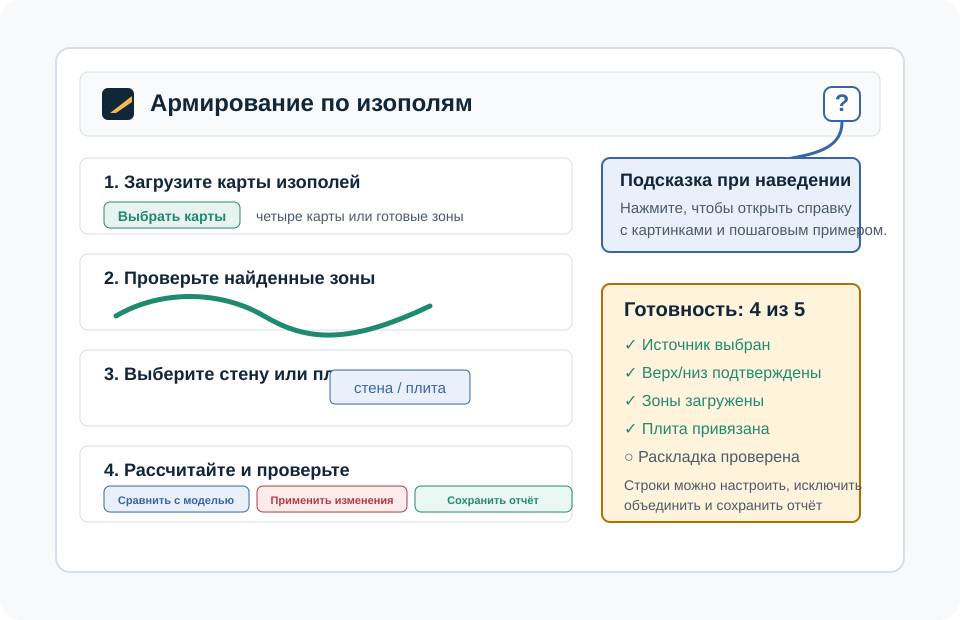

# Армирование по изополям: пошаговая инструкция

Модуль помогает перенести зоны требуемого армирования с расчётных карт на прямую стену или горизонтальную плиту. Вы сначала проверяете карты и будущую раскладку, затем сравниваете её с моделью и только после этого разрешаете изменить арматуру.

## Что подготовить

- Откройте проект Revit и нужный вид.
- Подготовьте четыре карты из одного расчёта: две для направления X и две для направления Y.
- Убедитесь, что все четыре карты имеют одинаковый размер и масштаб.
- Для плиты заранее определите, какие карты относятся к низу и верху.
- Для стены определите, какие карты относятся к внутренней и наружной стороне.
- Выберите на карте три хорошо заметные точки, которые сможете указать и на конструкции. Третья точка не должна лежать на одной линии с первыми двумя.

Модуль работает с горизонтальными плитами и прямыми обычными стенами. Наклонные плиты, криволинейные, составные и витражные стены пока не поддерживаются.

## Что меняет модель

| Действие | Что произойдёт |
|---|---|
| Просмотр контуров в окне | Модель не изменится. |
| «Исправить зоны» | Изменится только текущий расчёт в окне. |
| «Показать линии на виде» | На текущем виде появятся вспомогательные линии. Это элементы модели, но не арматура. |
| «Удалить линии с вида» | Вспомогательные линии этого модуля будут удалены с текущего вида. |
| «Рассчитать раскладку» | Модель не изменится. |
| «Сравнить с моделью» | Модуль только прочитает ранее созданную им арматуру и покажет список будущих изменений. |
| «Сохранить отчёт» | Будут созданы файлы отчёта. Модель не изменится. |
| «Применить изменения» | После отдельного подтверждения изменится арматура, созданная этим модулем. Арматура, созданная вручную, не затрагивается. |

## Где открыть эту инструкцию

В правом верхнем углу окна нажмите кнопку со знаком вопроса. Откроется краткая инструкция с теми же названиями разделов и кнопок, что и в основном окне.

## Шаг 1. Загрузите карты изополей

1. На вкладке TrueBIM нажмите «Армирование по изополям».
2. В разделе «1. Загрузите карты изополей» нажмите «Выбрать карты или готовые зоны».
3. Выберите сразу четыре карты.
4. Убедитесь, что в окне появились четыре строки с небольшими изображениями карт.
5. Проверьте столбец «Карта». Должны быть назначены две карты для направления X и две карты для направления Y.
6. Если строка подсвечена красным, имя файла и заголовок указывают разное назначение. Выберите правильное назначение вручную.
7. Назначьте сторону конструкции:
   - для плиты — низ или верх;
   - для стены — внутреннюю или наружную сторону;
   - если конструкция ещё не выбрана — сторону 1 или сторону 2, затем проверьте назначение после выбора конструкции.
8. Нажмите «Найти зоны на 4 картах».
9. Дождитесь сообщения о завершении. Проверьте количество найденных контуров и цветовых шкал.

Если комплект понадобится ещё раз, нажмите «Сохранить комплект». Позже его можно открыть той же кнопкой «Выбрать карты или готовые зоны».

### Если открыт готовый файл с зонами

Такой файл подходит для ознакомления и проверки контуров. Для расчёта и создания арматуры всё равно понадобятся четыре исходные карты с цветовыми шкалами.

## Шаг 2. Проверьте найденные зоны

1. В разделе «2. Проверьте найденные зоны» осмотрите контуры.
2. Сравните их с исходными картами: форма, количество и расположение должны совпадать.
3. Нажмите «Исправить зоны», если нужно:
   - убрать лишнюю область;
   - вернуть ошибочно исключённую область;
   - выбрать другой диапазон площади;
   - объединить соседние области с одной карты и одного диапазона.
4. В окне исправления снимите флажок «Учитывать» у лишней зоны.
5. Для смены диапазона выберите нужное значение в столбце «Диапазон площади».
6. Для объединения выделите несколько соседних строк и нажмите «Объединить выбранные».
7. Нажмите «Применить правки».

### Вспомогательные линии на виде

Кнопка «Показать линии на виде» создаёт на текущем виде Revit вспомогательные линии по контурам зон. Они помогают сверить положение, но ещё не являются арматурой.

После проверки нажмите «Удалить линии с вида». Если зоны были исправлены, повторное нажатие «Показать линии на виде» заменит прежние линии новыми.

## Шаг 3. Выберите стену или плиту

1. В разделе «3. Выберите стену или плиту» нажмите «Выбрать стену/плиту».
2. Укажите конструкцию в Revit.
3. Прочитайте сообщение под кнопками:
   - если конструкция подходит, переходите к совмещению;
   - если конструкция не подходит, модуль объяснит причину.
4. Проверьте назначение сторон карт. Для выбранной плиты должны быть назначены низ и верх, для стены — внутренняя и наружная стороны.

## Шаг 4. Совместите карты с конструкцией

В раскрытом блоке «Совмещение карты с конструкцией по трём точкам» задаются три пары одинаковых точек: одна точка на карте и та же точка на стене или плите.

1. В строке «Точка 1 на карте» введите её положение по горизонтали и вертикали.
2. Нажмите «Указать точку 1 на конструкции» и выберите соответствующее место в Revit.
3. Повторите действия для второй и третьей точек.
4. Если вертикальное направление карты получилось обратным, включите «Перевернуть карту по вертикали».
5. Нажмите «Проверить привязку».
6. Осмотрите схему:
   - внешняя линия показывает границу конструкции;
   - пунктиром показаны отверстия;
   - зоны внутри конструкции показаны обычными цветами;
   - красные зоны полностью оказались за границами и не позволяют продолжить;
   - третья точка подтверждает правильность масштаба и поворота.
7. Если проверка не пройдена, исправьте координаты или выбранные точки и повторите её.
8. Если проверка пройдена, при необходимости нажмите «Сохранить привязку».

Кнопка «Восстановить привязку» доступна только для той же конструкции и того же вида. После восстановления модуль всё равно проверит её на текущих зонах.

## Шаг 5. Рассчитайте раскладку

1. В разделе «4. Рассчитайте и проверьте арматуру» раскройте «Параметры раскладки».
2. Выберите режим:
   - «Только усиление поверх базовой сетки» — первая сетка сочетания считается уже существующей;
   - «Полное сочетание внутри зон» — внутри каждой зоны создаётся всё указанное сочетание.
3. Укажите отступ арматуры от поверхности конструкции.
4. Укажите отступ от границ зон и отверстий.
5. Укажите минимальную длину стержня.
6. Нажмите «Рассчитать раскладку».
7. Проверьте на схеме линии стержней, их направление и количество.
8. Раскройте «Проверка зон и арматуры» и прочитайте все сообщения.

Ошибки не позволяют продолжить. Предупреждения требуют проверки. Если предупреждение допустимо, установите флажок «Я проверил отмеченные места и разрешаю применить эту раскладку».

Любое изменение карт, зон, привязки или параметров сбрасывает прежнее подтверждение предупреждений.

## Шаг 6. Проверьте и при необходимости настройте зоны

В таблице «Проверка зон и изменений» видны карта, сторона конструкции, сочетание арматуры, требуемая и принятая площадь, количество стержней и то, насколько уверенно найдена зона.

Чтобы изменить одну зону:

1. Выберите строку.
2. Нажмите «Настроить выбранную» или дважды щёлкните строку.
3. Оставьте зону в раскладке или снимите флажок, чтобы исключить её.
4. Выберите найденное сочетание либо введите своё.
5. Нажмите «Применить настройку».

После изменения раскладка пересчитается. Сравнение с моделью нужно будет выполнить заново.

Чтобы объединить зоны, выделите не менее двух соседних строк с одинаковыми настройками и нажмите «Объединить выбранные». Кнопка «Разъединить» вернёт исходные зоны. Кнопка «Сбросить всё» удалит все ручные настройки и объединения.

## Шаг 7. Сравните раскладку с моделью

1. Нажмите «Сравнить с моделью».
2. Дождитесь обновления таблицы.
3. Проверьте столбцы «Статус» и «Изменения».
4. Убедитесь, что количества добавляемых, изменяемых и удаляемых стержней ожидаемы.
5. При необходимости отберите строки по карте, результату сравнения, диаметру, шагу или точности поиска зоны.

Отбор строк меняет только вид таблицы. Он не исключает скрытые строки из применения.

Если модель изменилась после сравнения, модуль не применит устаревший список. Таблица обновится, и её нужно будет проверить ещё раз.

## Шаг 8. Сохраните отчёт и примените изменения

1. Нажмите «Сохранить отчёт», если результат нужно проверить позже или передать коллегам.
2. После проверки таблицы нажмите «Применить изменения».
3. В окне подтверждения ещё раз проверьте конструкцию, режим, количество зон и количество стержней.
4. Подтвердите действие.
5. Дождитесь блока «Последнее применение».
6. Проверьте, сколько стержней добавлено, изменено, удалено и оставлено без изменений.
7. Если отчёт был сохранён до применения, нажмите «Обновить итоговый отчёт».

Модуль меняет только арматуру, которую ранее создал сам на выбранной конструкции. Арматура, созданная вручную, не затрагивается. Повторное применение той же раскладки не должно создавать копии стержней.

## Что проверить после применения

- Стороны конструкции и направления X и Y.
- Отступ арматуры от поверхности конструкции.
- Отступы от границ и отверстий.
- Диаметры и шаг стержней.
- Количество добавленных, изменённых и удалённых стержней.
- Отсутствие лишних вспомогательных линий на виде.
- Возможность отменить все изменения арматуры одной стандартной командой отмены Revit.

## Частые затруднения

### Кнопка недоступна

Посмотрите блок «Готовность» справа. В нём написан следующий обязательный шаг. Обычно не назначена сторона одной карты, не пройдена привязка, не исправлена ошибка проверки или ещё не выполнено сравнение с моделью.

### Комплект не готов

Проверьте, что выбраны ровно четыре карты, для каждой указаны направление, номер и сторона конструкции, а размеры всех карт совпадают.

### Конструкция не поддерживается

Выберите прямую обычную стену или горизонтальную плиту. Для конструкций сложной формы расчёт и создание арматуры пока недоступны.

### Третья точка не прошла проверку

Выберите третью точку дальше от линии между первыми двумя. Проверьте, что на карте и в Revit указано одно и то же место, а направление карты задано правильно.

### Зона стала красной

Она полностью оказалась за границами конструкции. Проверьте точки совмещения, масштаб, направление карты и правильность выбранной стены или плиты.

### Раскладка содержит ошибку по площади

Принятая площадь арматуры меньше требуемой. Выберите другое сочетание диаметра и шага либо верните рассчитанное сочетание.

### Применение просит повторно проверить таблицу

После последнего сравнения модель изменилась. Это защитная проверка. Просмотрите обновлённые строки и снова нажмите «Применить изменения».

## Что приложить к сообщению об ошибке

- Версию Revit и название проекта.
- Четыре исходные карты или сохранённый комплект.
- Снимок окна на шаге, где возникла ошибка.
- Название выбранной стены или плиты.
- Краткое описание: что было выбрано, какая кнопка нажата и что произошло.
- Журнал работы, который открывается кнопкой «Открыть журнал работы».
